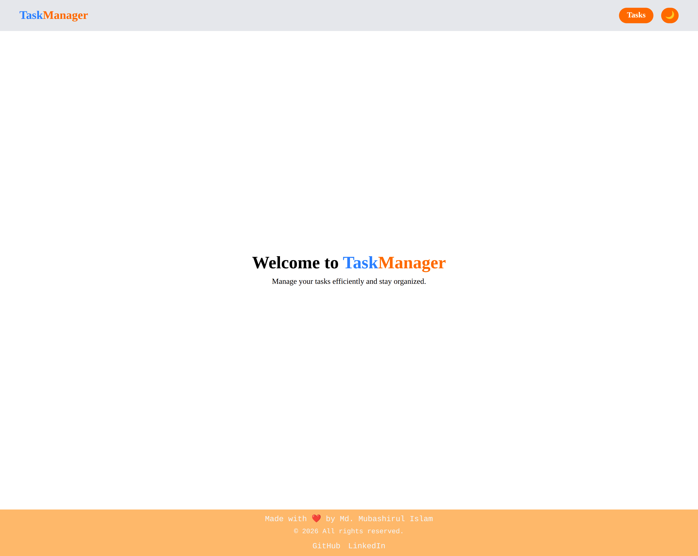
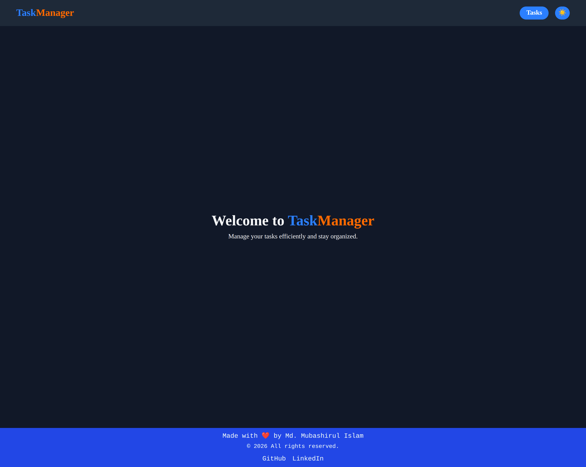
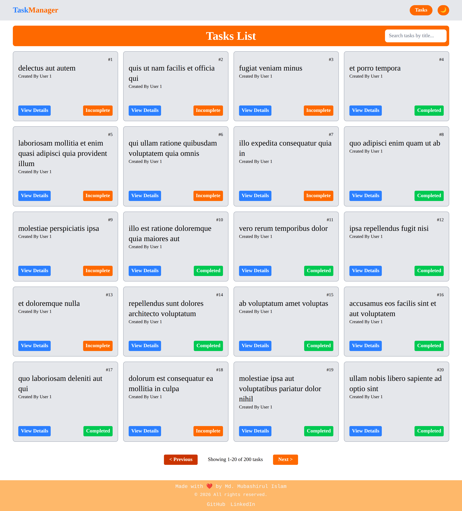
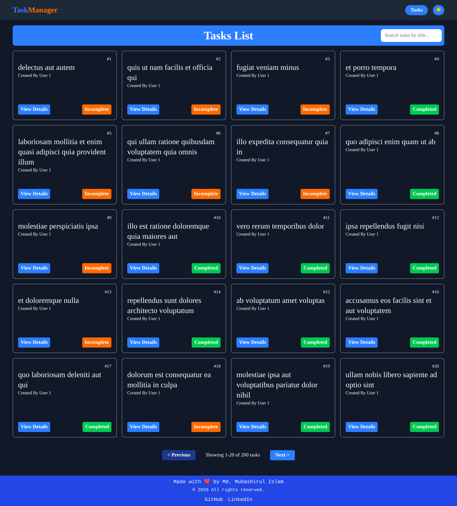
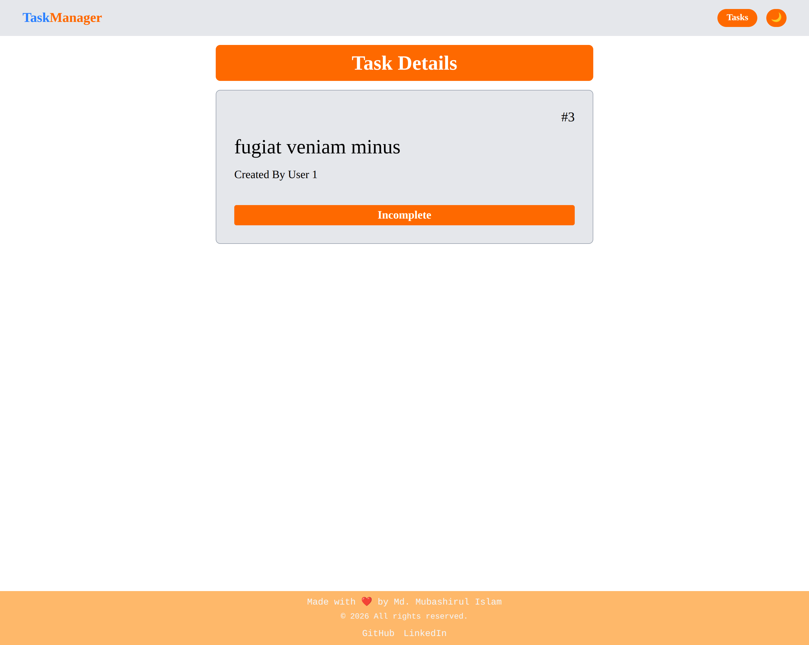
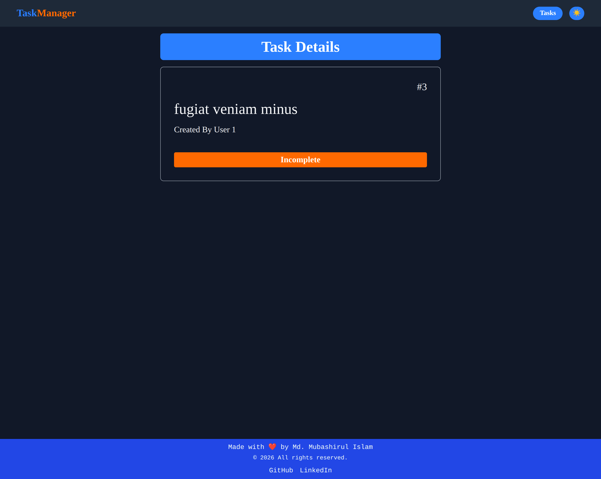
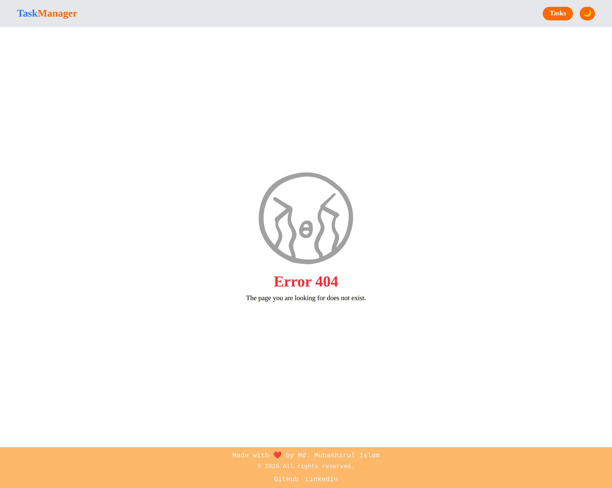
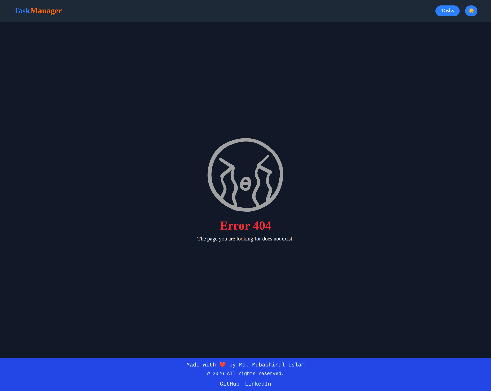

# TaskManager (React)

TaskManager is a simple, responsive task viewer built with React, Vite, and Tailwind CSS. It fetches tasks from JSONPlaceholder and provides search, pagination, and detail views with light/dark theme support.

## Features

- Browse tasks with pagination (20 per page)
- Search tasks by title
- Task details page with status indicator
- Local completion toggle (UI only)
- Loading shimmers, error, and no-result states
- Light/Dark theme toggle with persistence
- Responsive layout

## Tech Stack

- React 19
- React Router
- Vite
- Tailwind CSS

## Getting Started

### Prerequisites

- Node.js 18+ (recommended)

### Install

1. Install dependencies:

   - `npm install`

2. Start the dev server:
   - `npm run dev`

### Build & Preview

- Build: `npm run build`
- Preview: `npm run preview`

### Lint

- `npm run lint`

## Routes

- `/` — Home
- `/tasks` — Tasks list
- `/tasks/:taskId` — Task details
- `*` — Error page

## Data Source

Tasks are fetched from JSONPlaceholder:

- https://jsonplaceholder.typicode.com/todos

Note: The completion toggle is local UI state and does not persist to the API.

## Project Structure

```
src
├── components/   UI components (navbar, footer, shimmers, etc.)
├── context/      Theme context and provider
├── hooks/        Reusable hooks (useFetch)
└── pages/        Route-level pages
```

## Screenshots

### Home Page




### Tasks List Page




### Task Details Page




### Error Page



